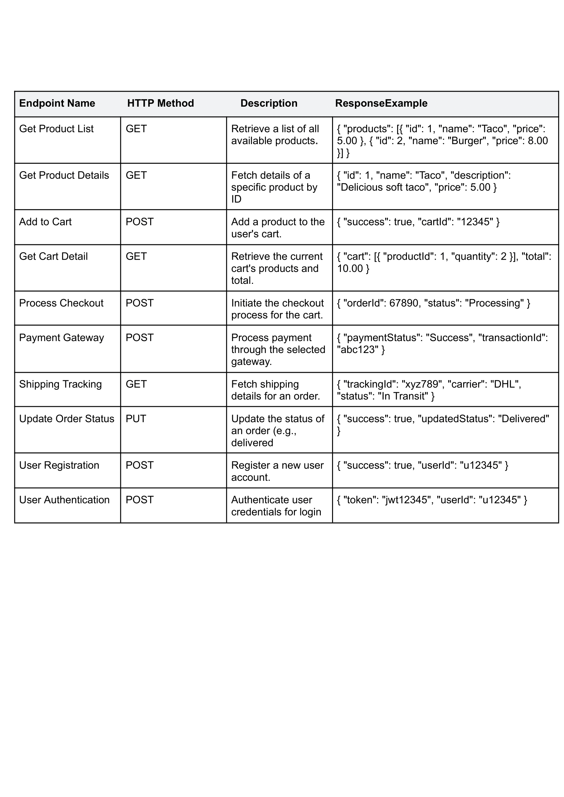

# **FoodTuck Online Food Ordering Platform**

**Author:** Wajahat Ali  
**Role:** Lead Developer  
**Roll Number:** 00103369

---

## **Overview**

The **FoodTuck Online Shopping Platform** is an innovative marketplace that allows users to browse, order, and track food items seamlessly. This document details the platform's system architecture, technical workflows, schema design, and key functionalities.

---

## **System Architecture**

### **High-Level Overview**

### **Components:**

1. **Frontend (Next.js):**
   - Interactive and responsive UI for users to browse products, manage carts, and check out.
   - Real-time API integrations to fetch and display dynamic product and order data.

2. **Sanity CMS:**
   - Backend system for managing product details, categories, user data, and order records.
   - Exposes APIs for smooth data synchronization between frontend and backend.

3. **Third-Party APIs:**
   - **Shipment Tracking API (ShipEngine):** Real-time tracking for shipped orders.
   - **Payment Gateway (Stripe):** Secure payment processing.

4. **Product Data API:**
   - Dynamic product catalog management with stock and price updates.

---

## **Key Workflows**

### **1. User Registration:**
- **Process:**
  - Users sign up via the frontend.
  - Data is securely stored in Sanity CMS.
- **Outcome:** Account creation and seamless login.

### **2. Product Browsing:**
- **Process:**
  - Users browse products via dynamic frontend pages.
  - Product data (name, price, stock, description) is fetched from Sanity CMS.
- **Outcome:** Users view detailed product listings.

### **3. Order Placement:**
- **Process:**
  - Users add items to their cart and proceed to checkout.
  - Payment is processed via Stripe, and order details are saved in Sanity CMS.
- **Outcome:** Order confirmation and receipt sent to the user.

### **4. Shipment Tracking:**
- **Process:**
  - Users track their orders using ShipEngine.
- **Outcome:** Real-time tracking updates displayed on the user dashboard.

### **5. Inventory Management:**
- **Process:**
  - Sanity CMS updates product stock levels automatically after orders.
  - Out-of-stock products are displayed with a wishlist option.
- **Outcome:** Efficient stock management and cart operations.

---

## **API Endpoints**



---

## **Sanity CMS Schema**

```javascript
export default {
  name: 'product',
  type: 'document',
  title: 'Product',
  fields: [
    {
      name: 'name',
      type: 'string',
      title: 'Product Name',
      description: 'Name of the product.',
      validation: (Rule) => Rule.required().max(100).error('Product name is required and must be under 100 characters.'),
    },
    {
      name: 'slug',
      type: 'slug',
      title: 'Slug',
      options: {
        source: 'name',
        maxLength: 200,
      },
      validation: (Rule) => Rule.required().error('Slug is required for product identification.'),
    },
    {
      name: 'description',
      type: 'text',
      title: 'Description',
      validation: (Rule) =>
        Rule.required()
          .min(20)
          .max(500)
          .error('Description must be between 20 and 500 characters.'),
    },
    {
      name: 'price',
      type: 'number',
      title: 'Price',
      validation: (Rule) => Rule.required().min(0).error('Product price must be a positive value.'),
    },
    {
      name: 'discountPercentage',
      type: 'number',
      title: 'Discount Percentage',
      validation: (Rule) => Rule.min(0).max(100).error('Discount percentage must be between 0 and 100.'),
    },
    {
      name: 'rating',
      type: 'number',
      title: 'Rating',
      validation: (Rule) => Rule.min(0).max(5).precision(1).error('Rating must be between 0 and 5.'),
    },
    {
      name: 'image',
      type: 'image',
      title: 'Product Image',
      options: { hotspot: true },
      validation: (Rule) => Rule.required().error('Product image is required.'),
    },
  ],
};
```

---

## **Technical Roadmap**

1. **Week 1:**
   - Set up Next.js frontend.
   - Configure Sanity CMS.

2. **Week 2:**
   - Integrate Sanity CMS APIs with the frontend for product and order data.
   - Implement user registration and login workflows.

3. **Week 3:**
   - Add payment gateway (Stripe).
   - Integrate shipment tracking using ShipEngine.

4. **Week 4:**
   - Finalize workflows, optimize frontend, and test the system end-to-end.

---

## **Conclusion**

The FoodTuck platform is designed to revolutionize online food shopping with a user-friendly interface, efficient backend integrations, and secure transactions. This comprehensive document ensures a robust development and deployment process, enabling FoodTuck to provide an exceptional user experience.

